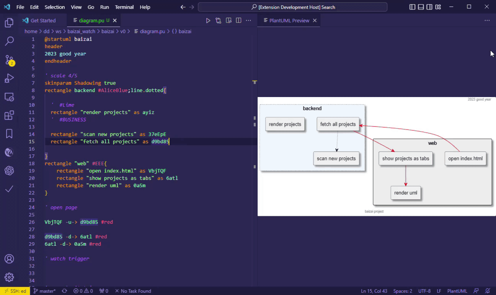

# plantuml-master README

help to master plantuml with some utility commands

## Features

1. Delete entity with all occurences, `deleteEntity`
2. Add relation between two entities, you can custom line style optionaly, see video below, `entityAddRelation`

**Enjoy!**
